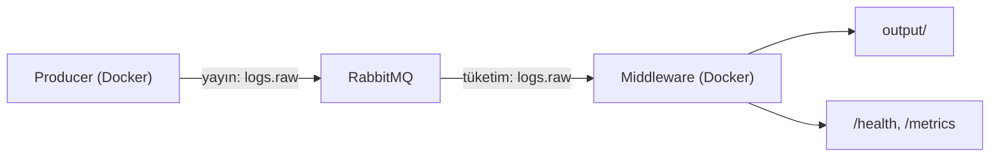
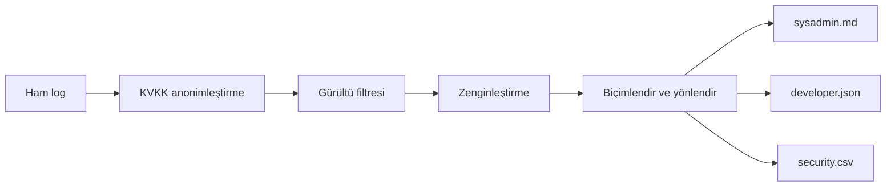

# CENG302 Logging Middleware

RabbitMQ tabanlı, KVKK uyumlu bir log middleware projesidir. Sistem üç bileşenden oluşur: log üreten **Producer**, logları işleyen **Middleware** ve iki uygulama arasında tampon görevi gören **RabbitMQ** broker.

Bu belge, projeyi ilk kez inceleyenler ile demo veya sunum sırasında hızlı referans ihtiyacı duyanlar için hazırlanmıştır.

## Özet

| Bileşen | Görev |
|---------|--------|
| Producer | Borsa benzeri senaryolardan log üretir ve `logs.raw` kuyruğuna yayımlar |
| RabbitMQ | Mesajları kuyrukta tutar; yüksek trafikte tampon sağlar |
| Middleware | Logları işler, role göre dosyaya yazar; `/health` ve `/metrics` sunar |

İşleme hattı: **Anonimleştir → Filtrele → Zenginleştir → Biçimlendir ve yönlendir**

## Mimari

### Sistem akışı



### Middleware pipeline



## Temel özellikler

- **KVKK maskeleme:** TC kimlik, kredi kartı, IBAN, SWIFT/BIC ve e-posta alanları diske ham hâliyle yazılmaz.
- **Filtreleme:** `DEBUG`, `INFO`, `WARNING` seviyeleri ile `docker.*` kaynaklı altyapı gürültüsü elenir.
- **Zenginleştirme:** `sender_id`, `transaction_no`, `criticality` ve role göre mesaj etiketleri eklenir.
- **Rol bazlı çıktı:** `sysadmin` → Markdown, `developer` → JSONL, `security` → CSV. HTML biçimi yapılandırma ile desteklenir.
- **Tasarım kalıpları:** Chain of Responsibility, Strategy, Decorator, Factory, Singleton.
- **CI/CD:** pytest, Docker Compose doğrulaması, E2E smoke testi ve artifact yükleme.

## Gereksinimler

- Python 3.11+
- Docker ve Docker Compose
- (İsteğe bağlı) GitHub Actions artifact incelemesi için GitHub hesabı

## Hızlı başlangıç

### 1. Bağımlılıkları kurun

```bash
python -m pip install -r producer/requirements.txt
python -m pip install -r middleware/requirements.txt
python -m pip install -r requirements-dev.txt
python -m pip install pytest
```

### 2. Demo için servisleri başlatın

Yalnızca RabbitMQ ve Middleware'i ayağa kaldırın; Producer'ı ayrı terminalde kontrollü çalıştırın:

```bash
docker compose up --build rabbitmq middleware
```

### 3. Producer ile örnek yük gönderin

```bash
docker compose run --build --rm producer python -m producer.src.main --total 200 --rate 50 --batch 20
```

Beklenen çıktı örneği:

```text
Publish done. published=200 elapsed=4.10s throughput=48.70 log/s
```

### 4. Sistemi kapatın

```bash
docker compose down
```

## Demo ve sunumda kullanılacak adresler

| Kaynak | Adres / konum |
|--------|----------------|
| RabbitMQ yönetim paneli | http://localhost:15672 (`guest` / `guest`) |
| Sağlık kontrolü | http://localhost:8000/health |
| Metrikler | http://localhost:8000/metrics |
| Çıktı dosyaları | `output/` |
| Performans grafikleri | `reports/plots/` |
| Sunum akış rehberi | `docs/SUNUM_RAPORU.md` |

## Çıktı dosyaları

Varsayılan rol → biçim eşlemesi:

| Rol | Biçim | Dosya |
|-----|--------|-------|
| `sysadmin` | Markdown | `output/sysadmin.md` |
| `developer` | JSONL (satır başına bir JSON nesnesi) | `output/developer.json` |
| `security` | CSV | `output/security.csv` |

Eşleme `middleware/src/config.py` içindeki `ROLE_FORMAT_MAP` ile değiştirilebilir.

## Performans raporu ve grafikler

Dolu grafikler için önerilen sıra:

```bash
python scripts/e2e_smoke.py
python scripts/performance_report.py --reports-dir reports --skip-queue-fetch
```

Üretilen dosyalar:

| Dosya | Açıklama |
|-------|----------|
| `reports/e2e_metrics.json` | Metrik anlık görüntüsü |
| `reports/queue_samples.jsonl` | Kuyruk derinliği örnekleri |
| `reports/performance_summary.md` | Özet metin raporu |
| `reports/plots/*.png` | Pipeline, gecikme ve kuyruk grafikleri |

Grafikler yerelde üretildikten sonra aşağıda görünür:


Grafikler boş görünüyorsa önce `scripts/e2e_smoke.py` çalıştırın; bu betik metrik anlık görüntüsünü ve kuyruk örneklerini oluşturur.

## Betikler (`scripts/`)

| Betik | İşlev |
|-------|--------|
| `e2e_smoke.py` | Docker ortamında uçtan uca test: compose aç/kapa, log gönder, çıktı ve metrik doğrula |
| `performance_report.py` | Metrik ve kuyruk verisinden PNG grafikleri ve Markdown özet üretir |

## Testler

Tüm test suite:

```bash
python -m pytest -q
```

E2E smoke testi (Docker gerekir):

```bash
python scripts/e2e_smoke.py
```

Faz bazlı test dosyaları: `tests/test_phase1_producer.py` … `tests/test_phase9_performance_report.py`

## Tasarım kalıpları ve kod konumları

| Kalıp | Konum |
|-------|--------|
| Chain of Responsibility | `middleware/src/pipeline/` |
| Strategy | `middleware/src/formatting/` |
| Decorator | `middleware/src/enrichment/enrichers.py` |
| Factory | `producer/src/generators/log_factory.py`, `middleware/src/formatting/formatter_factory.py` |
| Singleton | `middleware/src/metrics/collector.py` |

## Proje yapısı

| Klasör | İçerik |
|--------|--------|
| `producer/` | Log üretimi, RabbitMQ yayımlayıcı, stres test araçları |
| `middleware/` | Consumer, pipeline, biçimlendirme, API, metrikler |
| `shared/` | Ortak `LogRecord` şeması |
| `tests/` | Faz bazlı birim ve entegrasyon testleri |
| `docs/` | Özellikler, kararlar, faz raporları, sunum rehberi |
| `output/` | Rol bazlı çıktı dosyaları |
| `reports/` | Metrik, E2E ve performans raporları |

## CI/CD

Workflow dosyası: `.github/workflows/ci.yml`

| Job | Yaptığı iş |
|-----|------------|
| `tests` | Bağımlılık kurulumu, `pytest`, `docker compose config` doğrulaması |
| `e2e-smoke` | Gerçek Docker ortamında E2E test, ardından performans raporu ve grafik üretimi |
| Artifact | `output/` ve `reports/` GitHub'a yüklenir |

## Ek dokümantasyon

- Davranış sözleşmesi: [`docs/SPECS.md`](docs/SPECS.md)
- Mimari kararlar: [`docs/DECISIONS.md`](docs/DECISIONS.md)
- Faz durumu: [`docs/STATE.md`](docs/STATE.md)
- Faz raporları: [`docs/phase-reports/`](docs/phase-reports/)
- Sunum rehberi: [`docs/SUNUM_RAPORU.md`](docs/SUNUM_RAPORU.md)
